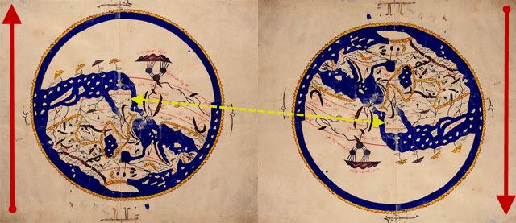
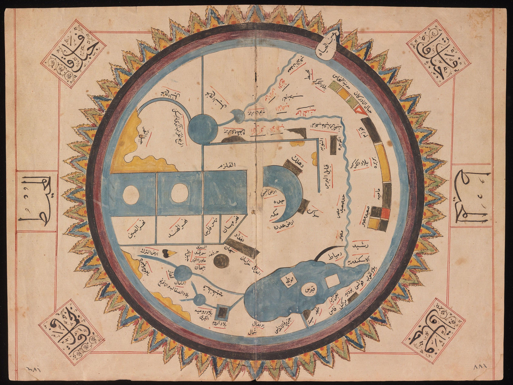
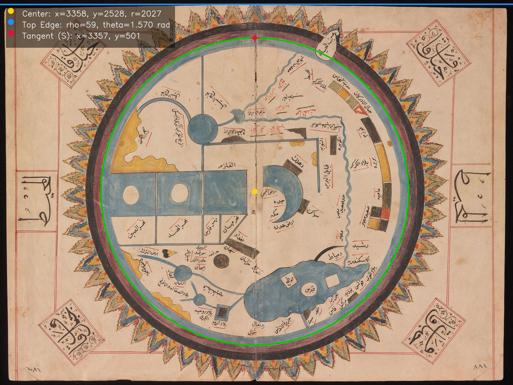
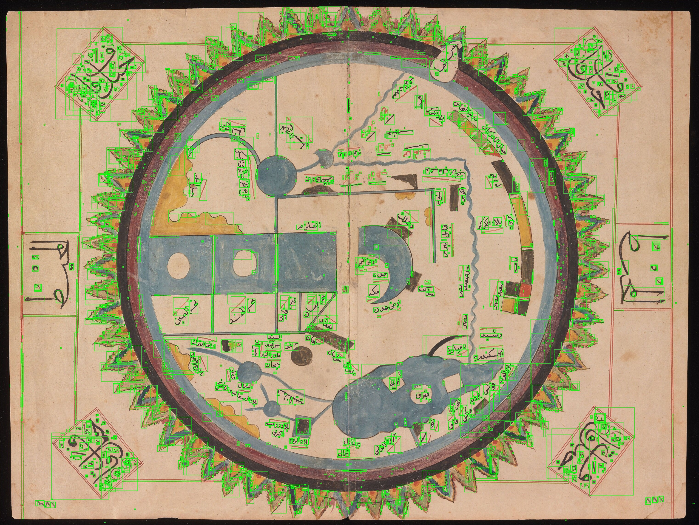

# Arabic Maps Project

A digital-humanities toolkit for **large-scale analysis of circular world maps** in medieval Arabic manuscripts. The project turns visual variation into data by detecting each map’s circular frame, identifying a reference edge, computing the tangent point, and (optionally) detecting Arabic text regions to support OCR and toponym analysis.

---

## Contents
- [Motivation](#motivation)
- [Highlights](#highlights)
- [Installation](#installation)
- [Quick start](#quick-start)
- [Data layout](#data-layout)
- [CLI usage](#cli-usage)
- [Outputs](#outputs)
- [Roadmap](#roadmap)
- [Development](#development)
- [License](#license)

---

## Motivation

Medieval Arabic circular world maps—often south-up, with Mecca near the top—vary by copyist and time. Shifts in framing, scale, orientation, and label placement may encode transmission histories and local practices, but they’re hard to compare by eye.

This toolkit makes those choices **measurable**. It detects a map’s circular frame, establishes a common south-up orientation via a reference edge and tangent line, and yields a polar coordinate system. With standardized geometry, we can **compare maps quantitatively** across authors, manuscripts, and centuries to trace workshop influence, reuse, and change over time.



*Left: Original Al-Idrīsī 12th-century map with Mecca at the top and Europe in the lower right.  
Right: Flipped view to match a north-up orientation.* [\[1\]](https://www.1001inventions.com/maps/)

---

## Example Results



*Map extracted from a sixteenth-century Ottoman manuscript of Persian cosmographer and geographer al-Qazwīnī’s “The Marvels of Creation.”*




*`params_overlay.jpg` depicting geometric parameters (circle, center, top-edge, tangent South / جنوب / الجَنوب, cardinal directions*



*`_mser.jpg` depicting text detection's current state of affairs: Catching >90% of all text with MSER method, with many false-positives.*

---

## Highlights

- **Metadata extraction**: image type, size, dimensions, color space. Assumes south-up orientation (South/جنوب/الجَنوب nearest the top edge).
- **Circle detection** (`src/circle.py`): Hough-based, with interactive refinement and batch candidate review.
- **Edge detection** (`src/edges.py`): Canny + Hough for (near-horizontal) top edge; ROI-guided interactive mode available.
- **Tangent computation** (`src/utils/tangent.py`): computes the upper tangent point from circle and edge parameters (labeled South / جنوب / الجَنوب).
- **Text detection** (`src/text_detection.py`): morphology, MSER, Canny, Sobel, and gradient variants; optional NMS and geometric/stroke-width filters.
- **Unified pipeline** (`pipeline.py`): runs metadata → circle → edge → tangent and writes overlays.

---

## Installation

```bash
git clone https://github.com/timnolanjr/arabic-maps-project.git
cd arabic-maps-project
pip install -r requirements.txt
```

**Requirements (excerpt from `requirements.txt`):**
- numpy<2.0, pandas>=1.5, opencv-python>=4.11
- matplotlib, Pillow, tqdm
- (Optional OCR stack) mmcv/mmengine/mmdet/mmocr, easyocr, paddleocr
- PyTorch versions pinned for compatibility in `requirements.txt`

Python 3.9–3.11 is recommended. GPU is **not required** for the geometry steps.

---

## Quick start

```bash
# 1) Create and activate a virtual environment (example with venv)
python -m venv .venv
source .venv/bin/activate

# 2) Install
pip install --upgrade pip
pip install -r requirements.txt

# 3) Put raw images in data/raw_maps/
#    e.g., data/raw_maps/al-Qazwini_Arabic_MSS_575.jpg

# 4) Run the full geometry pipeline (non-interactive, prompts per image)
python pipeline.py data/raw_maps
```

You will get per-image folders under `data/processed_maps/<image_stem>/` with a `params.json` and visual overlays.

---

## Data layout

```
arabic-maps-project/
├── data/
│   ├── raw_maps/            # your input TIFF/JPG/PNG scans
│   └── processed_maps/      # auto-created outputs (per-image folders)
├── scripts/                 # helper CLIs
├── src/                     # library code
│   ├── circle.py            # circle detection & review
│   ├── edges.py             # top-edge detection (batch/interactive)
│   ├── text_detection.py    # text detectors (beta)
│   └── utils/
│       ├── image.py         # grayscale & blur helpers + display
│       ├── io.py            # json I/O & per-image output dirs
│       ├── interactive.py   # point-click helpers
│       ├── metadata.py      # params.json init from image
│       └── tangent.py       # tangent point computation
├── pipeline.py              # unified multi-image pipeline
├── requirements.txt
└── README.md
```

---

## CLI usage

### 1) Unified pipeline
Process a directory of images (prompts per file; skips completed work):
```bash
python pipeline.py data/raw_maps -o data/processed_maps
```

### 2) Circle detection
Batch candidates (non-interactive), then review interactively:
```bash
# Generate candidates
python scripts/test_circle.py data/raw_maps/map1.jpg

# Review and pick final circle
python scripts/pick_circle.py data/raw_maps/map1.jpg -o data/processed_maps
```

Or fully interactive with perimeter clicks + ROI refinement:
```bash
python scripts/test_circle.py data/raw_maps/map1.jpg --interactive -o data/processed_maps
```

### 3) Edge detection
Batch mode (global Canny+Hough with horizontal-angle filter):
```bash
python scripts/test_edges.py data/raw_maps/map1.jpg -o data/processed_maps
```

Interactive, ROI-guided (click ~3 points along the top edge, then refine):
```bash
python scripts/test_edges.py data/raw_maps/map1.jpg --interactive -o data/processed_maps
```

### 4) Text detection
Run a detector over a glob of images and save drawn boxes per image:
```bash
# Methods: morph | mser | canny | sobel | gradient
python scripts/test_text_detection.py "data/raw_maps/*.jpg" --method mser -o data/processed_maps
```

Common flags (see `scripts/test_text_detection.py` for full list):
- `--interactive` – show a window for each result instead of saving.
- `--nms-filter` – apply non-max suppression to reduce overlapping boxes.

**MSER-specific flags (subset):**
```
--mser-delta 5
--mser-min-area 60
--mser-max-area 14400
--mser-max-variation 0.3
--mser-min-diversity 0.2
--mser-max-evolution 1000
--mser-area-threshold 1.01
--mser-min-margin 0.003
--mser-edge-blur-size 3
--mser-geom-filter
--mser-sw-filter
--mser-sw-threshold 0.4
```

---

## Outputs

For each input image `data/raw_maps/NAME.EXT`, the pipeline writes to `data/processed_maps/NAME/`:

- `params.json` – single source of truth for derived geometry and metadata (these are from `assets/images/al-Qazwīnī_Arabic_MSS_575.jpg`):
  ```json
  {
    "filetype": "jpg",
    "filesize": 1234567«6121401,
    "image_width": 6760,
    "image_height": 5080,
    "colorspace": "sRGB",
    "center_x": 3358,
    "center_y": 2528,
    "radius": 2027,
    "rho": 217.3,
    "theta": 1.567,
    "tangent_x": 3349.8,
    "tangent_y": 501.0
  }
  ```
- `params_overlay.jpg` – combined overlay with circle, edge, cardinal markers, and annotation.


---

## Roadmap

1. **Detection & OCR**
   - Add deep-learning text detectors (e.g., DBNet/PSENet via MMOCR) as optional backends.
   - Integrate Arabic OCR (EasyOCR, PaddleOCR, MMOCR recognizers) with post-processing.
   - Automate **toponym normalization & transliteration**.

2. **Geometry & Alignment**
   - Export polar coordinates for boxes/labels using circle + tangent reference.
   - Implement multi-map **similarity metrics** (shape, label placement) and clustering.

3. **Visualization & Sharing**
   - Streamlit dashboard for per-map review and cross-map comparison.
   - Optional Google Sheets/Drive sync for metadata status tracking.

---

## Development

- Code lives under `src/`. Utilities are in `src/utils/`. Smoke tests are in `scripts/`.
- Prefer **pure functions** that accept arrays/paths and return data/arrays.
- Use **type hints** and **docstrings** consistently.

---

## License

MIT License.

