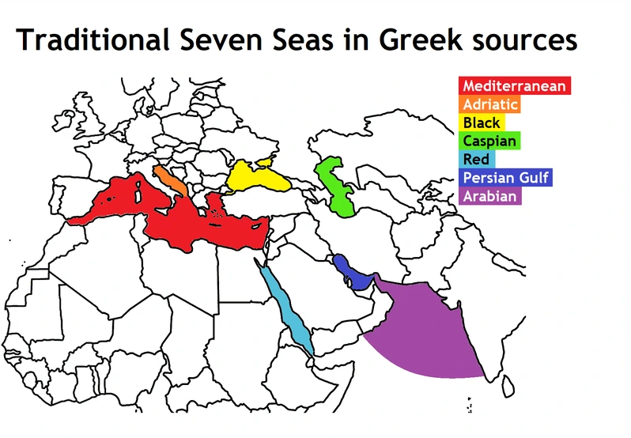

# Arabic Maps Project

A digital humanities toolkit for large-scale analysis of circular world maps in medieval Arabic manuscripts.

## Motivation

Medieval Arabic circular maps, with Mecca at the center, have long been studied
for their geographical insights, but scholars rarely compare them at the level
of individual manuscript copyists.  Each surviving map is a distinct artifact
shaped by scribal choices—subtle shifts in framing, scale, or label placement
that reflect workshops, regional tastes, or evolving worldviews.

By automatically detecting each map’s circular frame and projecting toponym
labels into polar coordinates, we can transform these subtle variations into
data.  Quantitative comparison across hundreds of maps may reveal patterns
of circulation, temporal shifts in cultural
perspective, and copyist creativity that text-only analysis alone cannot
capture.  Our toolkit brings a new, data-driven lens to the rich tradition of
Arabic cartography.


*Left: Original Al-Idrīsī 12th century map with Mecca (Makkah) at the top and Europe in the lower right.  
Right: Flipped view to match our modern North-up convention.*  [\[1\]](https://www.1001inventions.com/maps/)



*Medieval Greeks identified the “Seven Seas” differently than later Arab and European sources—an early example of how cultural perspective shaped mapping.*  [\[2\]](https://brilliantmaps.com/the-7-seas/)


*Map extracted from a sixteenth-century Ottoman manuscript of Persian cosmographer and geographer al-Qazwīnī’s “The Marvels of Creation.”*


## Features

- **Frame Alignment**: Hough-circle + top-edge registration  
- **Toponym Extraction**: CNN-based text detection + fine-tuned Arabic OCR  
- **Coordinate Normalization**: Polar coordinates relative to map radius  
- **Scalable Analysis**: Measure and visualize toponym shifts across manuscripts  


## Current Status

- **Circle Detection**: Fully interactive and batch modes via `src/circle.py` and `scripts/test_circle.py`.
- **Edge Detection**: Interactive ROI-based and batch detection via `src/edges.py` and `scripts/test_edges.py`.
- **Unified Parameters**: Circle and edge parameters (`center_x`, `center_y`, `radius`, `rho`, `theta`) merged into a single `params.json` per image.
- **Coordinate Mapping**: Pipeline for converting map frames into a common polar coordinate system is in place.
- **Next Steps**: Integrate OCR, toponym extraction, projection, and map comparison modules.

## Features

| Module              | Description                                                                 |
|---------------------|-----------------------------------------------------------------------------|
| Circle Detection    | Hough-based detection with interactive refinement or batch candidate generation |
| Edge Detection      | Hough lines in a vertical ROI around seed clicks to find the top manuscript edge |
| Parameter Management| Merge circle & edge parameters via `update_json` into `params.json`          |
| CLI Tools           | `scripts/test_circle.py`, `scripts/pick_circle.py`, `scripts/test_edges.py` |
| Utilities           | Preprocessing (`median_blur_and_gray`), I/O helpers (`save_json`, `update_json`) |

## Pipeline Overview

```
Raw Map Scans (TIFF, JPG, PNG)
    │
    ├─ Circle Detection → circle_final.jpg + params.json {center_x, center_y, radius}
    │
    ├─ Edge Detection   → edge_final.jpg   + params.json {rho, theta}
    │
    └─ (Future) OCR → Toponym Extraction → Polar Projection → Map Comparison
```

## Setup

1. **Python & venv**  
   ```bash
   python3 -m venv .venv
   source .venv/bin/activate
   pip install -r requirements.txt
   ```

2. **(Optional) pyenv**  
   ```bash
   pyenv install 3.11.6
   pyenv local 3.11.6
   ```

3. **(Optional) direnv**  
   ```bash
   brew install direnv
   echo "layout python3" > .envrc
   direnv allow
   ```

## Usage

### Circle Detection

```bash
# Single image, interactive:
python scripts/test_circle.py data/raw_maps/image.jpg --interactive

# Batch candidate generation:
python scripts/test_circle.py data/raw_maps/*.jpg
```

### Review Circle Candidates

```bash
python scripts/pick_circle.py data/raw_maps/image
```

### Edge Detection

```bash
# Interactive:
python scripts/test_edges.py data/raw_maps/image.jpg --interactive

# Batch:
python scripts/test_edges.py data/raw_maps/*.jpg
```

### Resulting Parameters

After both steps, each image folder contains `params.json`:

```json
{
  "center_x": 123.4,
  "center_y": 234.5,
  "radius": 345.6,
  "rho": 78.9,
  "theta": 1.23
}
```

## Roadmap

- **Text Detection**
  
- **OCR Integration**  
  Implement wrappers for EasyOCR, QARI, and Strabo pipelines to extract Arabic toponyms.
- **Toponym Extraction & Cleaning**  
  Normalize OCR output, deduplicate place names, and compute label centroids.
- **Polar Projection**  
  Convert toponyms’ centroids into polar coordinates relative to detected circle and edge.
- **Map Comparison & Clustering**  
  Compute similarity metrics, cluster maps by style and content, and visualize variation.
- **Metadata Sync**  
  Enhance Google Sheets/Drive integration with progress tracking and automated logging.
- **Packaging & Distribution**  
  Dockerize the pipeline, add CLI documentation, and publish on PyPI.


## Directory Layout

```
arabic-maps-project/
├── data/raw_maps/               # Original scans
├── scripts/
│   ├── test_circle.py
│   ├── pick_circle.py
│   └── test_edges.py
├── src/
│   ├── circle.py
│   ├── edges.py
│   └── utils/
│       ├── image.py
│       └── io.py
├── requirements.txt
└── README.md
```

## License

MIT License.

